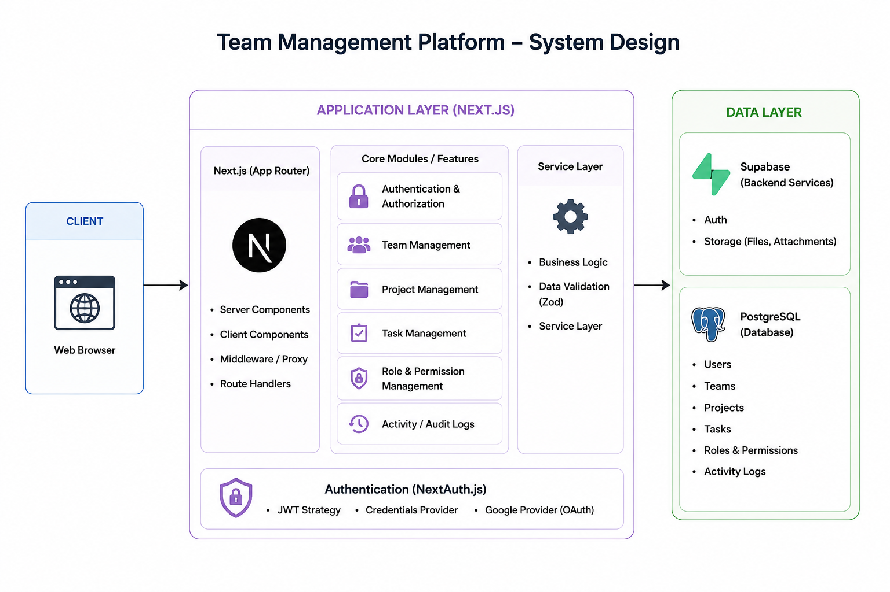

# Ethara Team Management Platform

A full-stack Team Management Platform built using Next.js, PostgreSQL, Supabase, NextAuth.js, and Redis. The platform helps organizations manage teams, employees, projects, and tasks with secure authentication and role-based access control.

---

# Features

* Authentication using NextAuth.js
* JWT-based session handling
* Credentials + Google OAuth login
* Team management dashboard
* Project management system
* Task assignment & tracking
* Role-based access control
* Activity logs for projects & tasks
* PostgreSQL database integration
* Redis caching for faster performance
* Responsive UI using Next.js

---

# Tech Stack

## Frontend & Backend

* Next.js
* TypeScript
* React

## Authentication

* NextAuth.js
* JWT Authentication
* Google OAuth

## Database & Backend Services

* PostgreSQL
* Supabase

## Performance

* Redis

## Deployment

* Vercel

---

# System Design



# Local Setup

## 1. Clone Repository

```bash
git clone <repository-url>
cd ethara-assignment
```

## 2. Install Dependencies

```bash
pnpm install
```

## 3. Add Environment Variables

Create a `.env.local` file:

```env
POSTGRES_URL=your_postgres_connection_string
NEXTAUTH_SECRET=your_secret
NEXTAUTH_URL=http://localhost:3000
GOOGLE_CLIENT_ID=your_google_client_id
GOOGLE_CLIENT_SECRET=your_google_client_secret
REDIS_URL=your_redis_url
```

## 4. Run Development Server

```bash
pnpm dev
```

## 5. Build Production Version

```bash
pnpm build
```

---

# Demo Login Credentials

Use the following demo credentials to test the application.

## Admin Account

| Role  | Email                                     | Password |
| ----- | ----------------------------------------- | -------- |
| Admin | [aarav@ethara.ai](mailto:aarav@ethara.ai) | 123456   |

---

## Team Leads

| Team       | Email                                       | Password |
| ---------- | ------------------------------------------- | -------- |
| Team Alpha | [riya@ethara.ai](mailto:riya@ethara.ai)     | 123456   |
| Team Beta  | [aditya@ethara.ai](mailto:aditya@ethara.ai) | 123456   |
| Team Gamma | [dev@ethara.ai](mailto:dev@ethara.ai)       | 123456   |
| Team Delta | [yash@ethara.ai](mailto:yash@ethara.ai)     | 123456   |

---

## Team Members

| Name         | Team       | Email                                       | Password |
| ------------ | ---------- | ------------------------------------------- | -------- |
| Kunal Mehta  | Team Alpha | [kunal@ethara.ai](mailto:kunal@ethara.ai)   | 123456   |
| Sneha Verma  | Team Alpha | [sneha@ethara.ai](mailto:sneha@ethara.ai)   | 123456   |
| Priya Nair   | Team Beta  | [priya@ethara.ai](mailto:priya@ethara.ai)   | 123456   |
| Rahul Joshi  | Team Beta  | [rahul@ethara.ai](mailto:rahul@ethara.ai)   | 123456   |
| Ishita Roy   | Team Beta  | [ishita@ethara.ai](mailto:ishita@ethara.ai) | 123456   |
| Neha Arora   | Team Gamma | [neha@ethara.ai](mailto:neha@ethara.ai)     | 123456   |
| Kabir Khan   | Team Gamma | [kabir@ethara.ai](mailto:kabir@ethara.ai)   | 123456   |
| Ananya Das   | Team Gamma | [ananya@ethara.ai](mailto:ananya@ethara.ai) | 123456   |
| Meera Iyer   | Team Delta | [meera@ethara.ai](mailto:meera@ethara.ai)   | 123456   |
| Arjun Rao    | Team Delta | [arjun@ethara.ai](mailto:arjun@ethara.ai)   | 123456   |
| Pooja Mishra | Team Delta | [pooja@ethara.ai](mailto:pooja@ethara.ai)   | 123456   |

---

## Bench Employees

| Name         | Position          | Email                                       | Password |
| ------------ | ----------------- | ------------------------------------------- | -------- |
| Rohan Sethi  | Backend Engineer  | [rohan@ethara.ai](mailto:rohan@ethara.ai)   | 123456   |
| Simran Gill  | Frontend Engineer | [simran@ethara.ai](mailto:simran@ethara.ai) | 123456   |
| Vikas Jain   | Devops Engineer   | [vikas@ethara.ai](mailto:vikas@ethara.ai)   | 123456   |
| Tanya Bhatia | QA Engineer       | [tanya@ethara.ai](mailto:tanya@ethara.ai)   | 123456   |

---

# Demo Data Included

The project contains placeholder seed data for:

* 20 Employees
* 5 Teams
* 5 Projects
* 21 Tasks
* Activity Logs
* Team Assignments
* Role Management

---

# Roles Supported

| Role        | Description                                  |
| ----------- | -------------------------------------------- |
| admin       | Full platform access                         |
| team_lead   | Manages projects and tasks for assigned team |
| team_member | Works on assigned tasks                      |
| on_bench    | Employee without active team assignment      |

---

# Project Modules

## Authentication Module

* Secure login system
* JWT sessions
* Google OAuth login
* Protected routes

## Team Management

* Create and manage teams
* Assign employees
* Track open/completed tasks

## Project Management

* Project creation
* Team assignment
* Progress tracking
* Deadline monitoring

## Task Management

* Task assignment
* Priority management
* Status updates
* Activity logging

---

# Deployment

The application is deployed using:

* Vercel
* PostgreSQL
* Supabase
* Redis

---

# Author

Deepanshu Rathore
